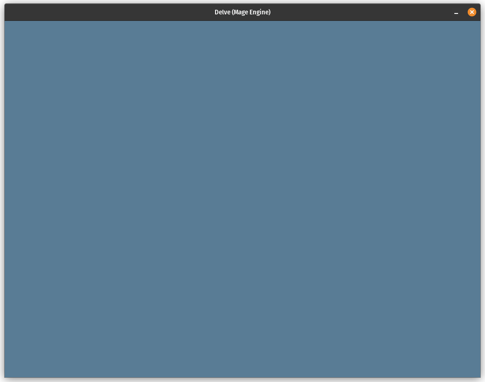
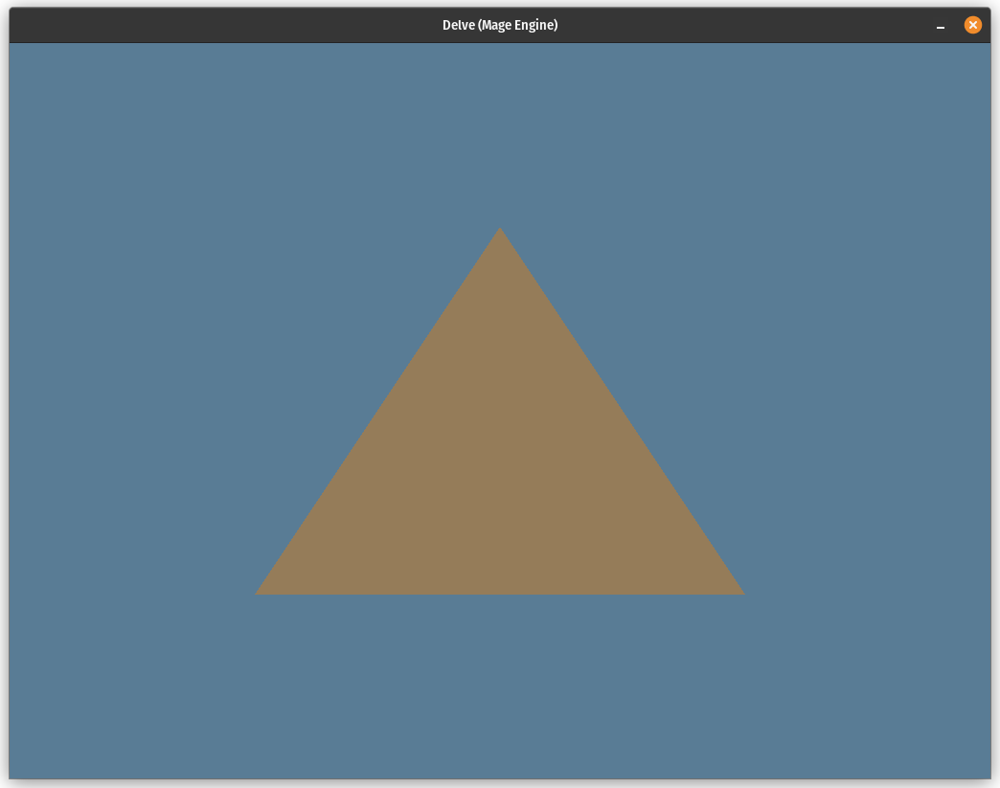

# Day 1

My first goal today is to open a window and have the graphics API up and
running.  The first step to doing this is using the `winit` crate.  Then I will
add the `wgpu` crate, which will be the 3D API I have chosen to use.  Although
it keeps changing, it is a great cross-platform solution.  I intend Delve to run
on Windows, Linux and macOSX.

Let's see how far I get.

## Winit

`Winit` is a crate for cross-platform window control.  It basically opens up a
window that implements the `HasRawWindowHandle` and `HasRawDisplayHandle`
traits.  These are defined in the `raw-window-handle` crate.  The `wgpu` crate
can use these handles to implement a 3D system that can render into the window.

First step is to set up an event loop:

```rust
let event_loop = EventLoop::new();
```

This is used to run the main event loop required to grab events from the OS and
allow us to react to them.  Events can be such things as windows closing and
resizing and keys being pressed.

Next we create a `Window` object via the `WindowBuilder` build object:

```rust
let window_size = PhysicalSize::new(1024, 768);
let window = WindowBuilder::new()
    .with_title("Delve (Mage Engine)")
    .with_inner_size(window_size)
    .build(&event_loop)
    .context("creating primary window")?;
```

We're able to use the build pattern to set the title and size of the window
before it is created.  The `context` call is used to give some context to why we
called `build()` if an error occurred.  `build()` returns a `Result` and the
`color-eyre` crate allows us to wrap the error with a context.

At this point, I call `event_loop.run(...)` to start the main loop which will
never return.  It will call the closure given repeatedly with an `Event` enum
which I match on.  Initially, I just react to a single event:
`Event::WindowEvent`.  This gives me access to another event of type
`WindowEvent` and from that pool of types, I react to either
`WindowEvent::CloseRequested` to detect the closing of the window, or
`WindowEvent::KeyboardInput` to check for the escape key being pressed.  Either
way, I set the input/output argument `control_flow` to `ControlFlow::Exit` to
tell the event loop to quit the game.

## Starting the 3D graphics

Next step was to use the WGPU tutorial to get the WGPU system up and running. My
first subgoal was to be able to clear the whole window to a particular colour
using the 3D API.  This is quite simple as that's the first thing the tutorial does.



I then went on to draw a triangle.  This requires that a shader program
(`shader.wgsl`) is written and loaded, and a command encoder and render pass
constructed to execute the shader and render an image to the surface of the
window.  At this stage, no geometry is passed to the GPU.  The vertex shader
constructs its vertices entirely from the index number that starts at 0 and
increments to 2.  The 3 vertices are then rasterised and the pixel shader
outputs a single colour:



## Refactoring

I still had some time so I decided that I didn't want the standard graphics
boilerplate entwined with the drawing commands specific to Delve.  So, I broke
up the code into several structs:

* __Screen__ - This encapsulates the GPU device and queue, and the window's
surface.  The device is required to create any GPU resources and the queue is
required to send commands to the GPU.

* __Material__ - This wraps the shader module that is compiled at compile time.
  The material also states the vertex and fragment shader entry points into the
  shader code.

* __Frame__ - This is created from the `Screen` object and represents the start
  of a single frame of rendering.  This object is responsible for creating the
  render passes that render pipelines are attached to.  The render passes are
  executed and the final image is presented via this.

* __RenderPass__ - A `RenderPass` object is used to generate an image on the
  window.  The frame object passes it a texture to render to.  Then pipelines
  are attached to it and draw commands issued.  The `RenderPass` object also
  determines how the existing pixels are treated.  For now, I just clear them to
  a particular colour.

* __RenderPipeline__ - A pipeline brings geometry, GPU resources and materials
together.  It provides a databank of information that the draw commands on a
render pass can use to render to a frame.  For now, we only associate the
materials for the vertex shader and fragment shader.

* __GfxError__ - using the `thiserror` crate, I've created my own error enums
  and messages.  Any problems in the system is reported via one of these enums.

Using these, I am able to separate the custom code from the infrastructure.

### The setup

To set up the rendering, I follow these steps (in the `main` function):

* Create a `Screen` instance.  This matches the window's width and height.  I
  also resize the screen every time the window resizes.  If the application is
  minimised and the window's surfaced lost, the `Screen` instance is also able
  to recreate itself.

* Create the triangle's `Material` and set up the entry points.

* Create a render pipeline that references the material twice, one for the
vertex shader and another for the fragment shader.  The same material is used
for both. I am not sure if I want to support different materials for each shader
category.

### Rendering

Here are the rendering steps (in the `render` function):

* Create a `Frame` object by calling `screen.start_frame(...)`.

* Create a `RenderPass` from the frame, attach the pipeline created in the set
  up and issue a draw command with 3 vertices.  This has to be in a block
  because the render pass object needs to be cleaned up as it mutably borrows
  the frame.

* Then I finish the frame with a call to `frame.finish(...)` passing it the
  screen's queue.  This consumes the `Frame` object and it can't be used any
  more.  Hence why the render pass needs to be dropped beforehand.

I like this clean separation.  I can clearly see the code required for general
rendering and the code I use just for delve.  This means I can reuse the
graphics code for other projects.

## Summary

That's all I did for today.  I got a triangle rendering.  Whoopy-doo!

Tomorrow, I want to draw a quad using vertex and index buffers.  With a bit of
luck, I may be able to load a texture in and render it to the quad.
