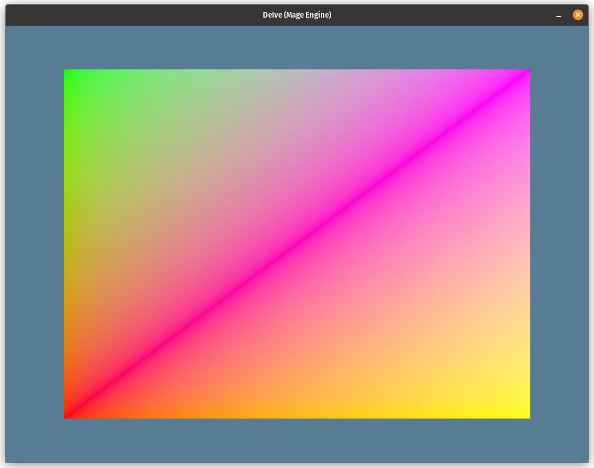

# Day 2

Today, I wanted to render a quad on the screen using vertex and index buffers.
I've extended the `gfx` API with the new `Buffer` object.  This object can hold
both an array of vertices and indices.

I also discovered and exploited the crate `wgpu_macros`.  This allows me to
annotate my vertex structure with the `VertexLayout` derive macro.  This
implements a constant `LAYOUT` for your structure that includes the
implementation of a `VertexBufferLayout` object.  This object describes the
layout of your vertex structure to WGPU.  The derive macro will figure out
anything based on the contents of your vertex structure.

I also decided to only allow one shader for each material.  Creating a material
that expects a certain vertex buffer layout is done thus:

```rust
let quad_material = screen
    .create_material(include_wgsl!("shader.wgsl"), "vs_main", "fs_main")
    .add_buffer_layout(Vertex::LAYOUT);
```

The vertex struct itself is defined as:

```rust
#[repr(C)]
#[derive(Copy, Clone, Zeroable, Pod, VertexLayout)]
struct Vertex {
    position: [f32; 3],
    colour: [f32; 3],
}
```

The `Zeroable` and `Pod` derive macros are from the `bytemuck` crate and allows
me to convert a slice of any type to a slice of `u8` elements.

The buffers themselves are created easily:

```rust
let quad_vertices = screen.create_vertex_buffer("Quad vertices", QUAD_VERTICES);
let quad_indices = screen.create_index_buffer("Quad indices", QUAD_INDICES);
```

The `QUAD_VERTICES` and `QUAD_INDICES` are just constant slices to `Vertex`
elements and `u16` elements respectively.

Finally, the rendering code is slightly altered:

```rust
render_pass.set_pipeline(pipeline);
render_pass.set_vertex_buffer(0, quad_buffer, ..);
render_pass.set_index_buffer(quad_indices, ..);
render_pass.draw_indexed(quad_indices.all());
```

The ranges mean I want all of the buffer to be used.  `draw_indexed` takes a
range also and that can be derived directly from the indices buffer using the
`all()` method.

## Refactoring the code

I want to move the `gfx` module into its own crate now so I did this today also.

Additionally, I added some code documentation using Copilot to help me generate
it.

## Final image of the day

